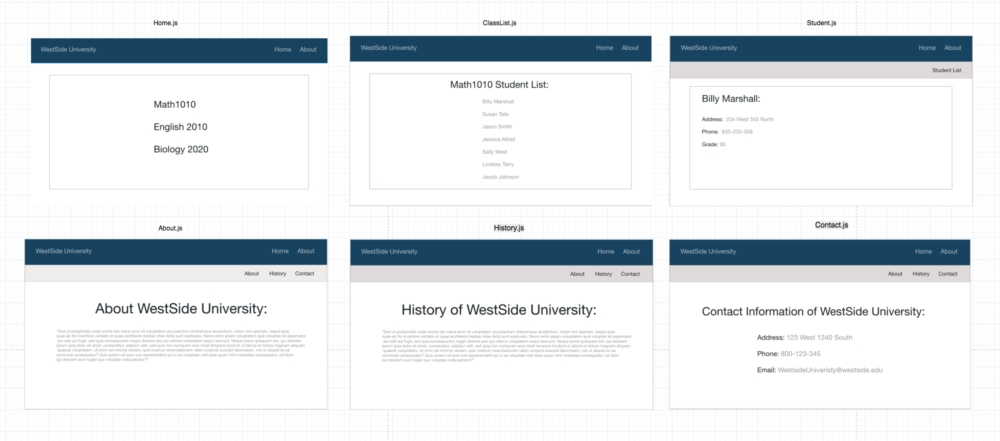

# Project Summary



In this project we will be building a site for a University to keep track of student and class information along with student enrollment. We will be using React Router to navigate between the various views required. Take some time to familiarize yourself with the provided components. 

* `App` will be the top level component for our application.
* `Home` will be the home page displayed when the application first loads.
* `About` will be the about page displaying information about the University.
    * `History` will be a nested view with the about page and will display the history of the university.
    * `Contact` will be a nested view with the about page and will display the University's contact information.
* `ClassList` will display all the enrolled students for that specific class.
* `Student` will be the detail view for a particular student.

## Setup:

* `Fork` and `clone` this repository
* `cd` into the project
* Run `npm install`;
    * One of the packages that was installed was `json-server`. This library will mimic a ReST api and allow you to make http requests for the student data.
* Run `npm start` to spin up the development server
* In a separate terminal, run `npm run api` to start the json-server.

## Step 1

### Summary

To begin our project, we will be installing the required dependencies and configuring the router.

### Instructions

* Install React Router.
* Create a new file in `src/` named `router.js`.
* Configure a router in `src/router.js`: 
    * Import `Switch` and `Route` from `react-router-dom`.
    * Import the following components to use as routes:
        * `src/components/Home/Home.js`
        * `src/components/About/About.js`
    * Create an empty `export default ()` statement.
    * Use the following combinations of paths and components for your router within the export default parentheses:
        * Path: "/" - Component: `Home` - This path should be exact.
        * Path: "/about" - Component: `About`.

### Solution

<details>

<summary>src/router.js</summary>

```jsx
import React from 'react';
import { Switch, Route } from 'react-router-dom';
import Home from './components/Home/Home';
import About from './components/About/About';

export default (
  <Switch>
    <Route component={ Home } exact path="/" />
    <Route component={ About } path="/about" />
  </Switch>
)
```

</details>

## Step 2

### Summary

In this step, we will take the router we just configured in `src/router.js` and add it to our application in `src/index.js`.

### Instructions

* Open `src/index.js`.
* Import `HashRouter` from `react-router-dom`.
* Wrap the `Provider` component in a `HashRouter` component.
* Open `src/components/App.js`.
* Import `router` from `src/router.js`.
* Underneath the `nav` element render the `router` JSX.

### Solution

<details>

<summary>src/index.js</summary>

```jsx
import React from 'react';
import ReactDOM from 'react-dom';
import { HashRouter } from 'react-router-dom';
import './index.css';
import App from './App';

ReactDOM.render(
    <HashRouter>
      <App />
    </HashRouter>
, document.getElementById('root'));
```

</details>

<details>

<summary>src/App.js</summary>

```jsx
import React, { Component } from 'react';
import router from './router';
import './App.css';

export default class App extends Component {

    render() {
        return (
           <div>
               <nav className='nav'>
                   <div>WestSide University</div> 
                   <div className='link-wrap'>
                        <div className='links'>Home</div>
                        <div className='links'>About</div> 
                   </div>  
               </nav>
            { router }
           </div> 
        )
    }

}
```

</details>

## Step 3

### Summary

In this step, we will be adding links to render our home and about views.

### Instructions

* Open `src/App.js`.
* Import `Link` from `react-router-dom`.
* Locate the `div` elements with className of links.
    * Replace the `div` elements to be `Link` components.
    * The Home link should be sent to `/`.
    * The About link should be sent to `/about`.

### Solution

<details>

<summary>src/App.js</summary>

```jsx
import React, { Component } from 'react';
import router from './router';
import './App.css';

export default class App extends Component {

    render() {
        return (
           <div>
               <nav className='nav'>
                   <div>WestSide University</div> 
                   <div className='link-wrap'>
                        <Link to="/" className='links'>Home</Link>
                        <Link to="/about" className='links'>About</Link> 
                   </div>  
               </nav>
            { router }
           </div> 
        )
    }

}
```

</details>

## Step 4

### Summary

In this step, we will be adding a new route for our `ClassList` component. We will also be adding `Link` components in the `Home` page to link to and render the `ClassList` component for each of the listed classes.

### Instructions

* Open `src/router.js`.
* Import the `ClassList` component to use as a route.
* `ClassList` will need to render the students for that specific class. In order to do this, we will be using params.
* Create a new route with the path being `/classlist/:class` and the component being the `ClassList` component you previously imported.
* Open `src/Home/Home.js`.
* Import `Link` from `react-router-dom`.
* Wrap each `button` element with a `Link` component.
* Each link should direct to the path `/classlist` with the class name added to the path ending.
    * Math 1010 - `/classlist/MATH1010`
    * English 2010 - `/classlist/ENG2010`
    * Biology 2020 - `/classlist/BIO2020`

The `ClassList` component will not be rendering the student enrollment list just yet, we will be doing that in the next step.

### Solution

<details>

<summary>src/router.js</summary>

```jsx
import React from 'react';
import { Switch, Route } from 'react-router-dom';
import Home from './components/Home/Home';
import About from './components/About/About';
import ClassList from './components/ClassList/ClassList';

export default (
  <Switch>
    <Route component={ Home } exact path="/" />
    <Route component={ About } path="/about" />
    <Route path='/classlist/:class' component={ ClassList } />
  </Switch>
)
```

</details> 

<details>

<summary>src/Home/Home.js</summary>

```jsx
import React, { Component } from 'react';
import { Link } from 'react-router-dom';
import '../../App.css';

export default class Home extends Component {

  render() {
    return (
      <div className="App">
        <Link to='/classlist/MATH1010'><button className='btn'>Math 1010</button></Link>
        <Link to='/classlist/ENG2010'><button className='btn'>English 2010</button></Link>
        <Link to='/classlist/BIO2020'><button className='btn'>Biology 2020</button></Link>
      </div>
    );
  }
}
```

</details>

## Step 5

### Summary


### Instructions


6. In the ClassList.js component we will be making a call to get our data from the `json-server`. 
    - Make a get request to `http://localhost:3005/students` and display all the student names in a list on the screen.


7. Each of the student's names will need to link Student.js component passing up the student's id to the url as a parameter. 
    

8. The Student.js component will take the Student's id which was passed as a parameter in the url and will make an api call to `http://localhost:3005/students/` + id to get and display the student's information. 


9. The About.js component will have a nested routes to the History and Contact components. 

