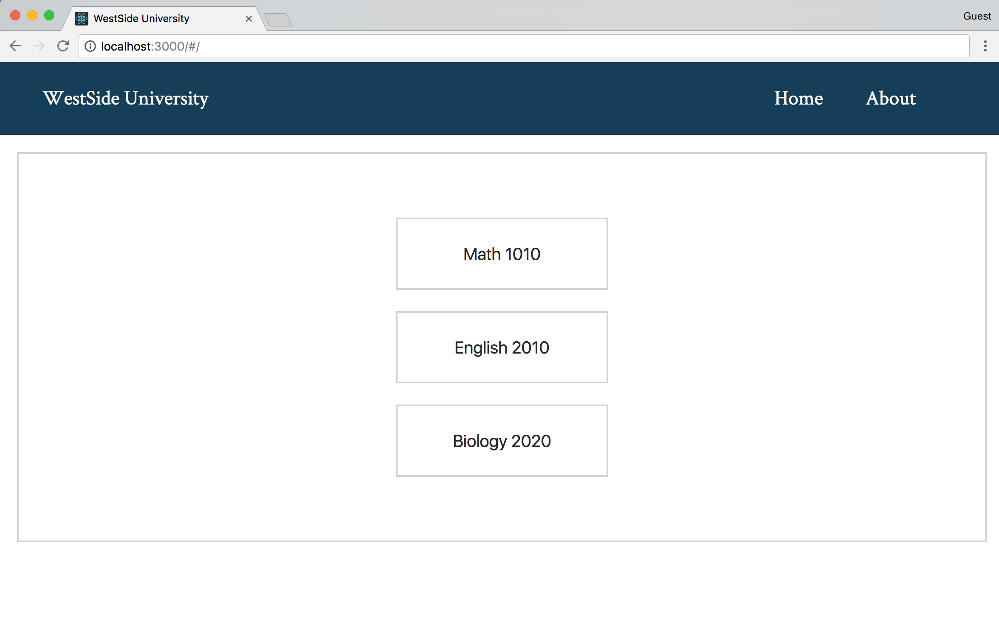
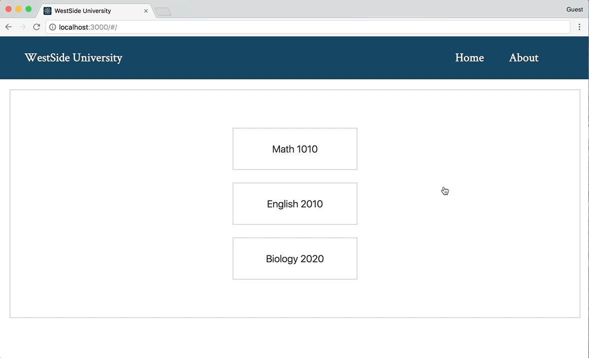

# Project Summary

In this project we will be building a site for a University to keep track of student information and class enrollment. We will be using React Router to navigate between the various views. Take some time to familiarize yourself with the provided components. 

* `App` will be the top level component for our application.
* `Home` will be the home page displayed when the application first loads. It will also display the available classes.
* `About` will be the about page displaying information about the University.
  * `History` will be a nested view with the about page and will display the history of the university.
  * `Contact` will be a nested view with the about page and will display the University's contact information.
* `ClassList` will display all the enrolled students for that specific class.
* `Student` will be the detail view for a particular student.

# Live Example

<a href="https://apis.devmountain.com/routing">Click Me!</a>


## Setup

* `fork` and `clone` this repository.
* `cd` into the project.
* Run `npm install`.
    * One of the packages that was installed is `json-server`.
    * This library will mimic a REST api and allow you to make HTTP requests for the student data.
      * This data is stored in `./db.json`.
    * Another package that was installed for you is `concurrently`.
    * This library will allow us to run multiple scripts in a single terminal window.
* Run `npm start` to spin up the development server <b>AND</b> the `json-server`.

## Step 1

### Summary

To begin our project, we will be installing additional dependencies required for configuring the router.

### Instructions

* Install React Router (`npm install --save react-router-dom`).
* Create a new file in `src/` named `routes.js`.
* Configure your routes in `src/routes.js`: 
    * Import React from `react`.
    * Import `Switch` and `Route` from `react-router-dom`.
    * Import the following components to use as routes:
        * `src/components/Home/Home.js`
        * `src/components/About/About.js`
    * Create an empty `export default ()` statement.
    * Use the following combinations of paths and components for your routes within the export default parentheses:
        * Path: "/" - Component: `Home` - This path should be exact.
        * Path: "/about" - Component: `About`.

### Solution

<details>

<summary>src/routes.js</summary>

```jsx
import React from 'react';
import { Switch, Route } from 'react-router-dom';
import Home from './components/Home/Home';
import About from './components/About/About';

export default (
  <Switch>
    <Route component={ Home } exact path="/" />
    <Route component={ About } path="/about" />
  </Switch>
)
```

</details>

## Step 2

### Summary

In this step, we will take the routes we just configured in `src/routes.js` and add it to our application in `src/index.js`.

### Instructions

* Open `src/index.js`.
* Import `HashRouter` from `react-router-dom`.
* Wrap the `App` component in a `HashRouter` component.
* Open `src/App.js`.
* Import `routes` from `./routes.js`.
* Underneath the `nav` element render the `routes` JSX.

### Solution

<details>

<summary>src/index.js</summary>

```jsx
import React from 'react';
import ReactDOM from 'react-dom';
import { HashRouter } from 'react-router-dom';
import './main.css';
import App from './App';

ReactDOM.render(
    <HashRouter>
      <App />
    </HashRouter>
, document.getElementById('root'));
```

</details>

<details>

<summary>src/App.js</summary>

```jsx
import React, { Component } from 'react';
import routes from './routes';

export default class App extends Component {

    render() {
        return (
           <div>
               <nav className='nav'>
                   <div>WestSide University</div> 
                   <div className='link-wrap'>
                        <div className='links'>Home</div>
                        <div className='links'>About</div> 
                   </div>  
               </nav>
            { routes }
           </div> 
        )
    }

}
```

</details>

## Step 3

### Summary

In this step, we will be adding links to render our home and about views.

### Instructions

* Open `src/App.js`.
* Import `Link` from `react-router-dom`.
* Locate the `div` elements with className of links.
    * Replace the `div` elements to be `Link` components.
    * The Home link should be sent to `/`.
    * The About link should be sent to `/about`.

### Solution

<details>

<summary>src/App.js</summary>

```jsx
import React, { Component } from 'react';
import { Link } from 'react-router-dom';
import routes from './routes';

export default class App extends Component {

    render() {
        return (
           <div>
               <nav className='nav'>
                   <div>WestSide University</div> 
                   <div className='link-wrap'>
                        <Link to="/" className='links'>Home</Link>
                        <Link to="/about" className='links'>About</Link> 
                   </div>  
               </nav>
            { routes }
           </div> 
        )
    }

}
```

</details>

## Step 4

### Summary

In this step, we will be adding a new route for our `ClassList` component. We will also be adding `Link` components in the `Home` component to link to the `ClassList` route for each of the listed classes.

### Instructions

* Open `src/routes.js`.
* Import the `ClassList` component to use as a route.
* The `ClassList` component will need to render the students for that specific class. In order to do this, we will be using params.
    * Create a new route with the path being `/classlist/:class` and the component being the `ClassList` component you previously imported.
* Open `src/Home/Home.js`.
* Import `Link` from `react-router-dom`.
* Wrap each `button` element with a `Link` component.
* Each link should direct to the path `/classlist` with the class name added to the path ending.
    * Math 1010 - `/classlist/MATH1010`
    * English 2010 - `/classlist/ENG2010`
    * Biology 2020 - `/classlist/BIO2020`

The `ClassList` component will not be rendering the student enrollment list just yet, we will be doing that in the next step.

### Solution

<details>

<summary>src/routes.js</summary>

```jsx
import React from 'react';
import { Switch, Route } from 'react-router-dom';
import Home from './components/Home/Home';
import About from './components/About/About';
import ClassList from './components/ClassList/ClassList';

export default (
  <Switch>
    <Route component={ Home } exact path="/" />
    <Route component={ About } path="/about" />
    <Route component={ ClassList } path="/classlist/:class" />
  </Switch>
)
```

</details> 

<details>

<summary>src/Home/Home.js</summary>

```jsx
import React, { Component } from 'react';
import { Link } from 'react-router-dom';

export default class Home extends Component {

  render() {
    return (
      <div className="box">
        <Link to='/classlist/MATH1010'><button className='btn'>Math 1010</button></Link>
        <Link to='/classlist/ENG2010'><button className='btn'>English 2010</button></Link>
        <Link to='/classlist/BIO2020'><button className='btn'>Biology 2020</button></Link>
      </div>
    );
  }
}
```

</details>



## Step 5

### Summary

We will now work with our `ClassList` component to display the students enrolled for that specific class. To get this data, we will be making an HTTP call to our `json-server`.

### Instructions

* Open `src/components/ClassList/ClassList.js`.
* We first need to initialize state for this component.
    * Within the `constructor` method, initialize state with a property named `students` set to the value of an empty array.
* Now we will be making an HTTP request to get the student enrollment data for the specific class.
    * We will be using `axios` to make our HTTP request.
        * Install the package `axios`.
        * Import `axios` into the `ClassList` component.
    * Create a `componentDidMount` lifecycle hook method.
    * Within this method, make a get request using `axios` to the URL `http://localhost:3005/students?class=`
        * This URL is incomplete, we need to be getting data for the specific class which is stored in the `params` object.
        * Using the `params` object, add the property value `class` to the ending of the request URL so that the get request will be making a query for the specific class that was selected.
    * Once the data returns, we will need to set `students` in state to the new data.
* Now that we are receiving the correct data and setting state to the newly received data, we need to display that data.
    * Create a new variable named `students` within the render method.
    * Set the variable `students` equal to the property `students` from state.
    * Now use a `.map()` method on `this.state.students`.
    * Within the `.map()` method's callback function, return an `h3` tag that renders the JSX for the student's `first_name` and `last_name`. Don't forget to give the element a unique `key` prop.
    * Underneath the `h2` tag with `ClassList:`, render the `students` variable JSX.
* Within the `h1` tags, put the value of the property class from the `params` object so that we can see the class name that we're looking at.

### Solution

<details>

<summary>src/components/ClassList/ClassList.js</summary>

```jsx
import React, { Component } from 'react';
import axios from 'axios';

export default class ClassList extends Component {
    constructor() {
        super();

        this.state = {
            students: []
        }
    }

    componentDidMount() {
        return axios.get(`http://localhost:3005/students?class=${this.props.match.params.class}`).then(res => {
            this.setState({
                students: res.data
            })
        })
    }

    render() {
        const students = this.state.students.map((student, i) => (
            <h3 key={i}>{ student.first_name } { student.last_name }</h3>
        ))

        return (
            <div className='box'>
                <h1>{ this.props.match.params.class }</h1>
                <h2>ClassList:</h2>
                { students }
            </div>
        )
    }

}
```

</details>

## Step 6

### Summary

Now that we are getting the class student enrollment list for each class, we will start setting up the Student detail view.

### Instructions

* Open `src/routes.js`.
* Import the `Student` component to use as a route.
* The `Student` component will need to render the details for a specific student. In order to do this, we will be using params.
    * Create a new route with the path being `/student/:id` and the component being the `Student` component you previously imported.
* Open `src/components/ClassList/ClassList.js`.
* Each of the student's names will need to link to the `Student` component by passing up the student's id to the URL as a parameter.
    * Import `Link` from `react-router-dom`.
    * Inside the callback function for the `.map()` method, wrap the `h3` tag being returned with a `Link` component. Have that `Link` component direct to `/student/${student.id}`.
    * Don't forget to move the unique `key` prop to the outer most element.
* You should now be able to navigate from the `ClassList` view to the `Student` detail view (which will be empty).

### Solution

<details>

<summary>src/routes.js</summary>

```jsx
import React from 'react';
import { Switch, Route } from 'react-router-dom';
import Home from './components/Home/Home';
import About from './components/About/About';
import ClassList from './components/ClassList/ClassList';
import Student from './components/Student/Student';

export default (
  <Switch>
    <Route component={ Home } exact path="/" />
    <Route component={ About } path="/about" />
    <Route component={ ClassList } path='/classlist/:class' />
    <Route component={ Student } path='/student/:id' />
  </Switch>
)
```

</details>

<details>

<summary>src/components/ClassList/ClassList.js</summary>

```jsx
import React, { Component } from 'react';
import { Link } from 'react-router-dom';
import axios from 'axios';

export default class ClassList extends Component {
    constructor() {
        super();

        this.state = {
            students: []
        }
    }

    componentDidMount() {
        return axios.get(`http://localhost:3005/students?class=${this.props.match.params.class}`).then(res => {
            this.setState({
                students: res.data
            })
        })
    }

    render() {
        const students = this.state.students.map((student, i) => (
            <Link to={`/student/${student.id}`} key={i}>
                <h3>{ student.first_name } { student.last_name }</h3>
            </Link>
        ))

        return (
            <div className='box'>
                <h1>{ this.props.match.params.class }</h1>
                <h2>ClassList:</h2>
                { students }
            </div>
        )
    }

}
```

</details>

## Step 7

### Summary

Using the student's id which was passed as a parameter in the url, we will make an HTTP request to our `json-server` for that specific student's information. We will display the specific student's information in the `Student` component.

### Instructions

* Open `src/components/Student/Student.js`.
* We first need to initialize state.
    * In the `constructor` method, initialize state with a property named `studentInfo` that is set to the value of an empty object.
* We now need to make an HTTP request to our `json-server` to get the information for the specific student.
    * Import `axios`.
    * Create a `componentDidMount` lifecycle hook method.
    * Inside of the `componentDidMount` lifecylce hook method, make a get request using `axios` to `http://localhost:3005/students/`. Using the `params` object, add to the end of the request URL the id that was passed as a parameter.
    * Update state's `studentInfo` to be the returning data.
* Now that we have the data for the student, we can display it on the page.
    * Underneath the `h1` tag, display state's `studentInfo` properties:
        * `first_name` and `last_name` within an `h1` tag.
        * The text `Grade:` followed by the `grade` property within an `h3` tag.
        * The text `Email:` followed by the `email` property within an `h3` tag.

### Solution

<details>

<summary>src/components/Student/Student.js</summary>

```jsx
import React, { Component } from 'react';
import axios from 'axios';

export default class Student extends Component {
    constructor() {
        super();

        this.state = {
            studentInfo: {}
        }
    }

    componentDidMount() {
        return axios.get(`http://localhost:3005/students/${this.props.match.params.id}`).then(res => {
            this.setState({
                studentInfo: res.data
            })
        })
    }
    
    render() {

        return (
            <div className='box'>
                <h1>Student:</h1>
                <h1>{this.state.studentInfo.first_name} {this.state.studentInfo.last_name}</h1>
                <h3>Grade: {this.state.studentInfo.grade}</h3>
                <h3>Email: {this.state.studentInfo.email}</h3>
            </div>
        )
    }
}
```

</details>



## Step 8

### Summary

We now will add a subnav bar that will link to the soon to be nested `About`, `History`, and `Contact` components.

### Instructions

* Open `src/components/About/About.js`.
* Import `Link` from `react-router-dom`.
* Inside the `div` with the className `subnav`, add 3 `h3` tags with the text:
    * `About`
    * `History`
    * `Contact`
* Wrap each `h3` tag with a `Link` component that links the following paths:
    * About - `/about`
    * History - `/about/history`
    * Contact - `/about/contact`
* Give each of these `Link` components the className `subnav_links`.

### Solution

<details>

<summary>src/components/About/About.js</summary>

```jsx
import React, { Component } from 'react';
import { Link } from 'react-router-dom';

export default class About extends Component {

    render() {
        return (
            <div>
                <div className='subnav'>
                    <Link to='/about' className='subnav_links'><h3>About</h3></Link>
                    <Link to='/about/history' className='subnav_links'><h3>History</h3></Link>
                    <Link to='/about/contact' className='subnav_links'><h3>Contact</h3></Link>                    
                </div>
                <div className='box'>
                </div>
            </div>
        )
    }
    
}
```

</details>

## Step 9

### Summary

We will finish by nesting the routes to the `About`, `History`, and `Contact` components.

### Instructions

* Open `src/components/About/About.js`.
* Import `Switch` and `Route` from `react-router-dom`.
* Import the `History` and `Contact` components.
* Inside the `div` with the className `box`, add a `Switch` component. 
* Add 2 routes inside the `Switch` component that will render the `History` and `Contact` components. Look to the `Link` components above for the correct paths.
* Inside that same `Switch` component, create a third route. 
    * Instead of using a component prop, this will use a `render` prop to render the JSX for the `About` page. Insert the following JSX in the render's function:
<details>

<summary>About JSX</summary>

```jsx
<div>
    <h1 className='title'>About WestSide University:</h1>
    <p>Lorem ipsum dolor sit amet, consectetur adipiscing elit. Sed euismod eu lorem et ultricies. In porta lorem at dui semper porttitor. Nullam quis cursus dui. Cras tincidunt vehicula tellus eu facilisis. Donec nisi turpis, iaculis et arcu a, aliquet ultrices nisl. Nam in pharetra odio, ac blandit metus. Suspendisse potenti. Praesent elementum diam non orci cursus rutrum. Pellentesque condimentum ultrices dignissim. Sed a tempor ligula, vel luctus sapien. Mauris vehicula rutrum massa. Duis condimentum, ex quis ullamcorper rhoncus, erat libero tempor arcu, condimentum facilisis tellus lectus ut nunc. Pellentesque vitae faucibus diam. Vestibulum eu erat ex. Ut justo neque, varius aliquet erat vel, scelerisque convallis lacus. Mauris semper lorem mauris, sed dignissim eros consectetur nec.</p>
</div>
```

</details>

* Make sure to add this route after the History and Contact routes otherwise only the About route will be loaded.
* You should now be able to navigate between each of the `About`, `History`, and `Contact` views from the sub nav.

### Solution

<details>

<summary>src/components/About/About.js</summary>

```jsx
import React, { Component } from 'react';
import { Switch, Route, Link } from 'react-router-dom';
import History from '../History/History';
import Contact from '../Contact/Contact';

export default class About extends Component {

    render() {
        return (
            <div>
                <div className='subnav'>
                    <Link to='/about' className='subnav_links'><h3>About</h3></Link>
                    <Link to='/about/history' className='subnav_links'><h3>History</h3></Link>
                    <Link to='/about/contact' className='subnav_links'><h3>Contact</h3></Link>                    
                </div>
                <div className='box'>
                    <Switch>
                        <Route path='/about/history' component={ History }/>
                        <Route path='/about/contact' component={ Contact }/>      
                        <Route path='/about' render={() => (
                            <div>
                                <h1>About the University</h1>
                                <p>Lorem ipsum dolor sit amet, consectetur adipiscing elit. Sed euismod eu lorem et ultricies. In porta lorem at dui semper porttitor. Nullam quis cursus dui. Cras tincidunt vehicula tellus eu facilisis. Donec nisi turpis, iaculis et arcu a, aliquet ultrices nisl. Nam in pharetra odio, ac blandit metus. Suspendisse potenti. Praesent elementum diam non orci cursus rutrum. Pellentesque condimentum ultrices dignissim. Sed a tempor ligula, vel luctus sapien. Mauris vehicula rutrum massa. Duis condimentum, ex quis ullamcorper rhoncus, erat libero tempor arcu, condimentum facilisis tellus lectus ut nunc. Pellentesque vitae faucibus diam. Vestibulum eu erat ex. Ut justo neque, varius aliquet erat vel, scelerisque convallis lacus. Mauris semper lorem mauris, sed dignissim eros consectetur nec.</p>
                            </div>
                        )}/>
                    </Switch>
                </div>
            </div>
        )
    }
    
}
```

</details>


## Black Diamond

Try adding a back button on the `Student` detail view that will route back to the `ClassList` view. You can also add a back button to the `ClassList` view that will route back to the `Home` view.

## Contributions

If you see a problem or a typo, please fork, make the necessary changes, and create a pull request so we can review your changes and merge them into the master repo and branch.

## Copyright

© DevMountain LLC, 2017. Unauthorized use and/or duplication of this material without express and written permission from DevMountain, LLC is strictly prohibited. Excerpts and links may be used, provided that full and clear credit is given to DevMountain with appropriate and specific direction to the original content.

<p align="center">

</p>
