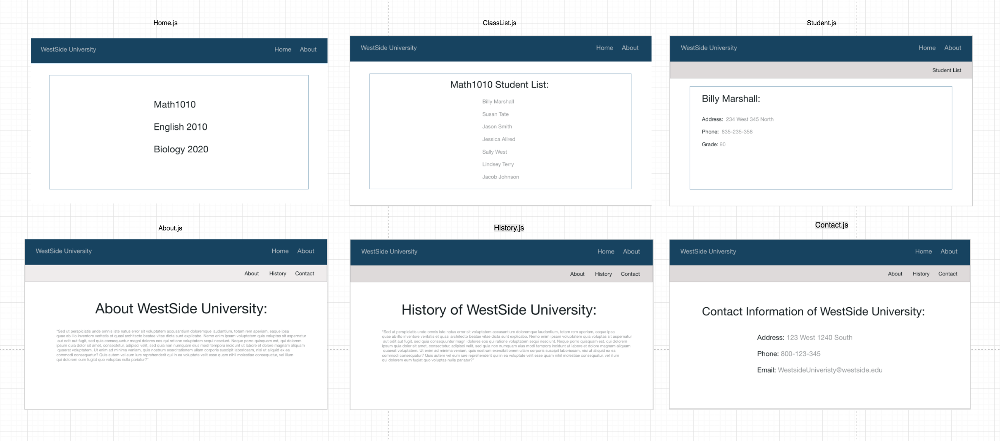

# routing-afternoon

## Instructions:

Goal: Create a web application with 4 different

1. Setup:
  - `Fork` and `clone` this repository
  - `cd` into the project
  - Run `npm install`;
    - One of the packages that was installed was `json-server`. This library will mimic a ReST api and allow you to make http requests for the student data.
 - Run `npm install --save react-router-dom`
 - Run `npm start` to spin up the development server
 - In a separate terminal, run `npm run api` to start the json-server.

2. In index.js, import HashRouter from 'react-router-dom'
    - Wrap the App component with HashRouter.
3. Create a router.js file.
  - import Switch, Route from 'react-router-dom'
  - Create an empty export default statement using ( ).
  - Import the following components:
    - Home - This componenet will be the landing page of our application.
    - About - This component will be a page that displays information about the university. 
  - Inside the parentheses return a Switch component with nested Route components: 
    - Home: 
        - Set the path prop of this component to be "/".
        - Add the exact prop to this component.
        - Set the component prop of this component to be { Home }
    - About: 
        - Set the path prop of this component to be "/about".
        - Set the component prop of this component to be { About }

4. In this step, we will modify our App.js to render our router onto the DOM.
    - Import router from src/router.js
    - Render router below the nav tags. 
    - Import Link from 'react-router-dom'.
    - Locate the elements with className of links.
        - Wrap these elements in their own Link Component.
        - Home link should be sent to '/'.
        - About link should be sent to '/about'.

5. In our Home.js file we need the Math 1010 button to link to our ClassList component. 

6. In the ClassList.js component we will be making a call to get our data from the `json-server`. 
    - Make a get request to `http://localhost:3005/students` and display all the student names in a list on the screen.

7. Each of the student's names will need to link Student.js component passing up the student's id to the url as a parameter. 
    

8. The Student.js component will take the Student's id which was passed as a parameter in the url and will make an api call to `http://localhost:3005/students/` + id to get and display the student's information. 

9. The About.js component will have a nested routes to the History and Contact components. 

